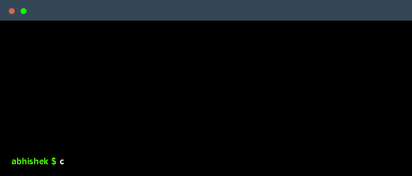

 

    

### 🚀 About Me
- 🔭 I’m currently working as a **Product Engineer @ TCS**
- 🌱 I’m currently focused on **Advanced Distributed Systems, Event-Driven Architecture (Kafka), & Generative AI**
- 💬 Ask me about **Java 17, Spring Boot, Microservices, and LLM Fine-Tuning**
- 📫 How to reach me: **[abhishekdwivedi94443@gmail.com](mailto:abhishekdwivedi94443@gmail.com)**

### 💻 Main Skills & Tools

**AI & Specialized Tech:**  
`Prompt Engineering` `LLM Fine-Tuning & RLHF` `RAG` `Agentic AI Workflows` `LangChain` `Spring AI` `OpenAI API` `Hugging Face` `Pinecone` `Chroma DB`

### 🏆 Achievements & GitHub Stats

  

  
  
  

### 🔗 Connect with me!

    
    

### 💼 Employer?
> [!IMPORTANT]  
> <a href="https://drive.google.com/file/d/1VK-LepQ3OvLX5Q9liF8dTvKUAe2oldgf/view?usp=sharing" target="_blank">Download my resume</a>

